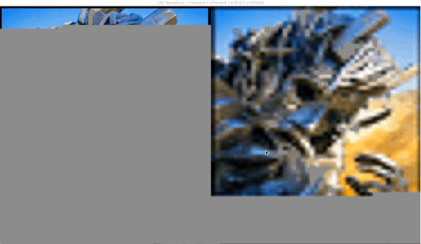

# Concorde

[](http://cocoadocs.org/docsets/Concorde)
[](http://cocoadocs.org/docsets/Concorde)
[](http://cocoadocs.org/docsets/Concorde)
[](https://travis-ci.org/contentful-labs/Concorde)
[](https://coveralls.io/r/contentful-labs/Concorde?branch=master)



This is a framework for downloading and decoding progressive JPEGs easily on iOS and OS X. It uses [libjpeg-turbo][1] as underlying JPEG implementation. We vendor version 1.4.0 of the static library from libjpeg-turbo's [official release][3] for convenience.

## Usage

Simply install it via [CocoaPods][4]:

```
pod 'Concorde'
```

and then use `CCBufferedImageView` which progressively downloads and shows an image:

```objective-c
let imageView = CCBufferedImageView(frame: ...)
if let url = NSURL(string: "http://example.com/yolo.jpg") {
	imageView.load(url)
}
```

If you use [Contentful][2], install the subspec:

```
pod 'Concorde/Contentful'
```

and replace your usage of `UIImageView` with `CCBufferedImageView` to automatically use progressive JPEGs
if you have been using the `UIImageView` category before. This will work regardless of the original format
of your files due to the image transformation functionality of the delivery API.

### Manual integration

You can also integrate Concorde as a subproject or download a binary build from the releases section. Please note that those are only provided for iOS at the moment.

## License

Copyright (c) 2015 Contentful GmbH. See LICENSE for further details.

`CCBufferedImageDecoder` is derived from [WebKit][5], see comments in its file for further copyright details.

The examples use <http://pooyak.com/p/progjpeg/>, which artificially slows the connection down to 0.5 Kilobyte/second to demonstrate the differences between regular and progressive JPEGs.


[1]: http://www.libjpeg-turbo.org
[2]: https://www.contentful.com
[3]: http://sourceforge.net/projects/libjpeg-turbo/files/1.4.0/libjpeg-turbo-1.4.0.dmg/download
[4]: http://cocoapods.org
[5]: https://www.webkit.org
